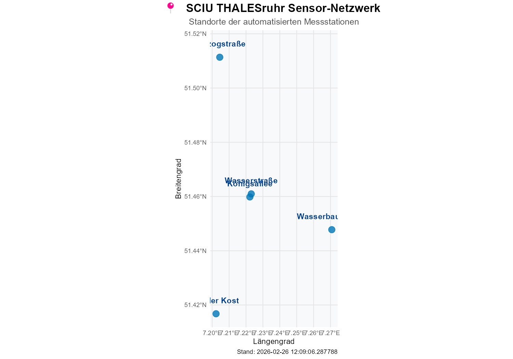

# SCIU THALESruhr - Sensor Data Management

### 📍 Sensor-Netzwerk

*Standorte der automatisierten Messstationen.*

> [!TIP]
> Die Standorte sind auch auf einer **[interaktiven Karte](data/sensor_map.html)** markiert. (Download & im Browser öffnen)


---

<!-- LATEST_EVENTS_START -->

## ✅ Keine neuen Ereignisse in den letzten 24h
*Stand: 2026-03-02 10:02:23 UTC*

---

<!-- LATEST_EVENTS_END -->


This repository manages the automated collection, processing, and analysis of sensor data from the Nivus DataKiosk for the SCIU project.

## 🛠 Project Structure

- **`.github/workflows/`**: GitHub Actions for daily automated data processing.
- **`data/`**:
    - `sensor_exports/`: Raw CSV data fetched directly from the Nivus API.
    - `cleaned_analysis/`: Processed data where levels are calculated and filtered.
    - `plots/`: Visualizations of sensor levels over time.
    - `detected_events.csv`: A log of all detected flooding events.
- **`scripts/`**:
    - `fetch_nivus_rest.R`: Fetches raw data from the Nivus REST API.
    - `automate_fetch.ps1`: Local Windows script to run the full pipeline.
    - `sync_git.ps1`: Automated hourly Git pull/push for local synchronization.
    - **`test_scripts/`**:
        - `sensor_level_analysis.R`: Cleans raw data and calculates water levels.
        - `plot_sensor_data.R`: Generates time-series plots for each station.
        - `event_detection.R`: Identifies and logs significant flooding events.

## 🤖 Automated Pipeline (GitHub Actions)

The data is automatically processed every day at **08:00 UTC**. The workflow:
1. **Fetch**: Downloads new data points for all monitored stations.
2. **Clean**: Filters noise and calculates "level" from distance readings.
3. **Plot**: Updates visual charts with the latest data.
4. **Detect**: Scans for new events above the defined threshold.
5. **Sync**: Commits all updates back to the repository.

### Setup (Secrets)
To enable the automated fetch, ensure the `NIVUS_API_KEY` is set as a repository secret in GitHub.

## 💻 Local Usage & Automation

### Running the Full Pipeline
You can trigger the entire fetch-and-analyze process manually on Windows:
```powershell
.\scripts\automate_fetch.ps1
```

### Automated Local Sync
To keep your local computer in sync with GitHub changes automatically (e.g., hourly), use the `sync_git.ps1` script with the **Windows Task Scheduler**.

1. Create a task in Task Scheduler.
2. Trigger: Daily, repeating every 1 hour.
3. Action: Start a program `powershell.exe`.
4. Arguments: `-ExecutionPolicy Bypass -File "C:\Path\To\Repo\scripts\sync_git.ps1"`

## 📊 Data Details

- **Levels**: Calculated as `Distance_to_Sensor - Reading`.
- **Filtering**: Automatic removal of spikes and non-water-related noise.
- **Event Detection**: Logged in `detected_events.csv` when levels exceed the specified threshold.
