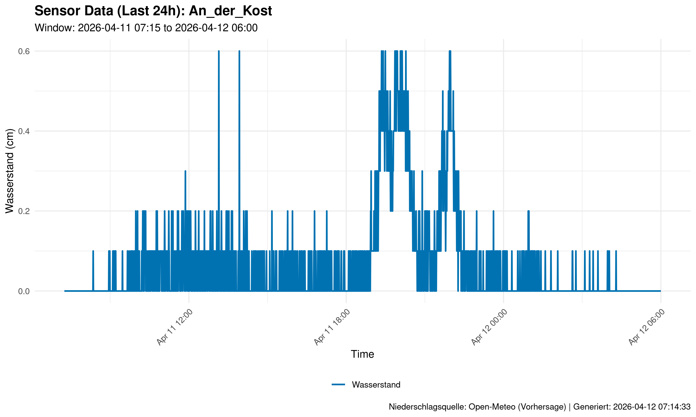
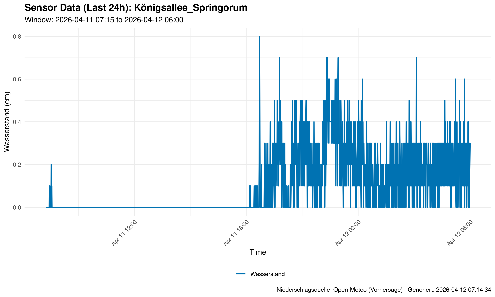

# SCIU THALESruhr - Sensor Data Management

<table>
<tr>
<td width="60%" valign="top">

<!-- LATEST_EVENTS_START -->
### 🔹 Wetterausblick (48h)
**Leichter bis mäßiger Regen vorhergesagt.**

*(Zeitraum: 12.04. 10:00 bis 14.04. 09:00)*

- Temperatur: **9.7°C** (Min: 7.1°C | Max: 14.4°C)
- Summe: **4.9 mm** | Max: **0.8 mm/h**
- Max. 6h: **3.9 mm**

*Quelle: Open-Meteo (DWD)*


### 🛠 Sensor-Status-Check

⚠️ **Achtung: Inaktive Sensoren erkannt!**
*(Hinweis: Dies kann auch durch einen Fehler im automatisierten Download-Prozess verursacht werden)*

- 🔴 **Herzogstraße**: Letzte Daten vor 114.5 Stunden (07.04. 12:47)


## 🔔 Aktuelle Ereignisse (Letzte 24-30h)
*Stand: 2026-04-12 07:14:55 UTC*

Es wurden **2** neue potenzielle Ereignisse erkannt.

|station                |start_time          | peak_level_cm| duration_min|
|:----------------------|:-------------------|-------------:|------------:|
|An_der_Kost            |2026-04-11 21:41:00 |           0.6|         24.0|
|Königsallee_Springorum |2026-04-11 19:31:00 |           0.7|         19.5|

### 📈 Aktuelle Plots der betroffenen Stationen
#### Station: An_der_Kost


#### Station: Königsallee_Springorum



---

<!-- LATEST_EVENTS_END -->

</td>
<td width="40%" valign="top">

<p align="center"><b>📍 Sensor-Netzwerk</b></p>


<p align="center">🔗 <b><a href="https://htmlpreview.github.io/?https://github.com/anihot/SCIU_THALESruhr/blob/main/data/output/sensor_map.html" target="_blank">Interaktive Karte anzeigen</a></b><br>(mit 24h Sensor-Daten Plots)</p>

</td>
</tr>
</table>

---

This repository manages the automated collection, processing, and analysis of sensor data from the Nivus DataKiosk for the SCIU project.

## 🛠 Project Structure

- **`.github/workflows/`**: GitHub Actions for daily automated data processing.
- **`data/`**:
    - `raw/`: Raw CSV data fetched directly from the Nivus API.
    - `processed/`: Processed data where levels are calculated and filtered.
    - `output/`: Final results like plots, maps, and summaries.
    - `metadata/`: Sensor coordinates and station configurations.
- **`scripts/`**:
    - `api/`: Scripts for fetching data from Nivus and RADOLAN.
    - `analysis/`: Data cleaning, level calculation, and event detection.
    - `visualization/`: Generation of plots and maps.
    - `automation/`: Tools for README updates and local automation.

## 🤖 Automated Pipeline (GitHub Actions)

The data is automatically processed every day at **08:00 UTC**. The workflow:
1. **Fetch**: Downloads new data points for all monitored stations.
2. **Clean**: Filters noise and calculates "level" from distance readings.
3. **Plot**: Updates visual charts with the latest data.
4. **Detect**: Scans for new events above the defined threshold.
5. **Sync**: Commits all updates back to the repository.

### Setup (Secrets)
To enable the automated fetch, ensure the `NIVUS_API_KEY` is set as a repository secret in GitHub.

## 💻 Local Usage & Automation

### Running the Full Pipeline
You can trigger the entire fetch-and-analyze process manually on Windows:
```powershell
.\scripts\automation\automate_fetch.ps1
```

### Automated Local Sync
To keep your local computer in sync with GitHub changes automatically (e.g., hourly), use the `sync_git.ps1` script with the **Windows Task Scheduler**.

1. Create a task in Task Scheduler.
2. Trigger: Daily, repeating every 1 hour.
3. Action: Start a program `powershell.exe`.
4. Arguments: `-ExecutionPolicy Bypass -File "C:\Path\To\Repo\scripts\sync_git.ps1"`

## 📊 Data Details

- **Levels**: Calculated as `Distance_to_Sensor - Reading`.
- **Filtering**: Automatic removal of spikes and non-water-related noise.
- **Event Detection**: Logged in `detected_events.csv` when levels exceed the specified threshold.
